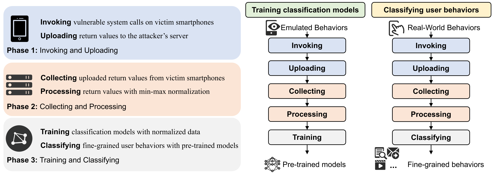

# EavesDroid: Eavesdropping User Behaviors via OS Side Channels on Smartphones

This repo contains the source code and dataset of our paper "EavesDroid: Eavesdropping User Behaviors via OS Side Channels on Smartphones" published in IEEE Internet of Things Journal (IoT-J).



## 0x01 Getting Started

Prerequisites:

- Android Studio
- Android NDK
- Python 3.11
  - numpy
  - matplotlib
  - keras
  - django
  - cydtw

## 0x02 Repo Structure

**1. Android App**

- `app/` contains the source code of our Android app.

- Please rename it to `Sampler` and import it into Android Studio to build the app.

- Note: `val api = "http://192.168.1.2:8000"` in `MainActivity.kt` should be changed to the proper server address.

**2. Server**

- `backend/` contains the source code of our Django server.

- Please run `python manage.py runserver` to start the server.

**3. Data Collection**

- `collection/` contains the source code of emulated data collection tool.

- Please run `python sample.py/sample2.py` to collect data from your own devices.

- Note: parameters should be changed to the proper values.

**4. Data Classification**

- `classification/` contains the source code of user behavior classification tool.

- `all_model.py` contains the baseline models used in our paper: 1D-CNN, LSTM, GRU.

- `dtw_model.py` contains the DTW-KNN algorithm used in our paper.

- `classify.py` is the main script to infer user behaviors with our CNN-GRU model.

**4. Dataset**

- `dataset/` contains the dataset used in our paper.

- Data in this directory can be used to train classification models and reproduce our results.

**5. Figures**

- `figures/` contains the figure generation scripts used in our paper.

- Files in this directory can be used to reproduce the figures in our paper.

## 0x03 Copyright and License

This project is licensed under the terms of the MIT License.

## 0x04 Contact and Citation

If you have any questions, please contact me through `GitHub Issues` or email: wangquancheng@whu.edu.cn.

If our work is useful for your research, please consider citing our paper:

```bibtex
@ARTICLE{wang2024eavesdroid,
  author={Wang, Quancheng and Tang, Ming and Fu, Jianming},
  journal={IEEE Internet of Things Journal (IoT-J)},
  title={EavesDroid: Eavesdropping User Behaviors via OS Side Channels on Smartphones},
  year={2024},
  volume={11},
  number={3},
  pages={3979-3993},
  doi={10.1109/JIOT.2023.3298992}
}
```
